<!-- Animated Header -->

 

  
  

 

<!-- Profile Description -->

<h2>
  
  О МЕНЕ / ABOUT ME
  
</h2>

  🚀 <b>Full-Stack Developer</b> with deep expertise in <b>Mobile, IoT & Drone Technologies</b> 
  🯠Specializing in <b>Enterprise Drone Control Systems</b> & <b>Real-Time IoT Solutions</b> 
  💡 Passionate about bridging <b>Hardware</b> and <b>Software</b> to create innovative solutions 
  🌐 Building systems from <b>embedded sensors</b> to <b>cloud-connected mobile apps</b>

 

---

 

<!-- Tech Stack Section -->
<h2>
  
  TECHNOLOGY STACK & EXPERTISE
</h2>

 

###  **MOBILE DEVELOPMENT**

  
  
  
  
  

<b>📱 Mobile Projects & Experience</b>

 
  
- ✅ **Cross-platform apps** with Flutter & Dart
- ✅ **Native Android** development with Kotlin & Java
- ✅ **Clean Architecture** & MVVM pattern implementation
- ✅ **State Management**: Provider, Riverpod, BLoC
- ✅ **Platform Channels** for native integration
- ✅ **Real-time data** synchronization & offline support

 

###  **DRONE SYSTEMS & ROBOTICS**

  
  
  
  
  

<b>🛸 Drone Development Experience</b>

 
  
- ✅ **DJI Mobile SDK** integration (Kotlin/Java)
- ✅ **Autel Robotics SDK** implementation
- ✅ **Autonomous flight missions** & waypoint navigation
- ✅ **Real-time telemetry** data processing
- ✅ **Custom flight controllers** & autopilot systems
- ✅ **Camera control** & gimbal stabilization
- ✅ **Live video streaming** & FPV implementation

 

###  **IoT & EMBEDDED SYSTEMS**

  
  
  
  
  

<b>⚡ Hardware & IoT Projects</b>

 

**🔌 Microcontrollers:**
- ESP32, ESP8266, Arduino UNO, Arduino Nano

**📡 Gas Sensors (Air Quality Monitoring):**
- MQ-2 (Smoke, LPG, Propane)
- MQ-3 (Alcohol)
- MQ-6 (LPG, Butane)
- MQ-7 (Carbon Monoxide)
- MQ-9 (CO, Flammable Gases)
- MQ-136 (Hydrogen Sulfide)
- MQ-137 (Ammonia)

**🎯 Motion & Environment Sensors:**
- MPU6050 (Gyroscope + Accelerometer)
- DHT11/DHT22 (Temperature + Humidity)
- BMP180/BMP280 (Pressure + Temperature)
- Ultrasonic sensors (Distance measurement)

**📊 Expertise:**
- ✅ Real-time sensor data collection & processing
- ✅ IoT monitoring systems
- ✅ UDP/TCP communication protocols
- ✅ Wireless data transmission (WiFi, Bluetooth)
- ✅ FreeRTOS implementation

 

###  **BACKEND & CLOUD**

  
  
  
  
  

<b>🔧 Backend Development Skills</b>

 

- ✅ **Node.js** server-side applications
- ✅ **RESTful API** design & implementation
- ✅ **Firebase** (Authentication, Firestore, Cloud Functions)
- ✅ **Real-time databases** & WebSocket connections
- ✅ **Cloud Functions** & serverless architecture
- ✅ **API Integration** & third-party services

 

---

 

<!-- Programming Languages -->
<h2>
  
  PROGRAMMING LANGUAGES
</h2>

  
  
  
  
  
  
  

 

---

 

<!-- System Architecture -->
<h2>
  
  SYSTEM ARCHITECTURE

```mermaid
graph TB
    subgraph Hardware ["🔧 HARDWARE LAYER"]
        A["🛸 Drone<br/>(DJI/Autel)"]
        B["📡 IoT Sensors<br/>(ESP32/Arduino)"]
        C["🎮 Gas Sensors<br/>(MQ Series)"]
        D["📊 Motion Sensors<br/>(MPU6050)"]
    end
    
    subgraph Controller ["⚡ CONTROLLER LAYER"]
        E["💻 C++ Logic<br/>(ESP32/Arduino)"]
        F["🔌 Protocol Handler<br/>(UDP/MAVLink)"]
    end
    
    subgraph Backend ["☁️ BACKEND LAYER"]
        G["🟢 Node.js Server"]
        H["🔥 Firebase<br/>(Auth/DB/Functions)"]
    end
    
    subgraph Mobile ["📱 MOBILE LAYER"]
        I["💎 Flutter UI<br/>(Dart)"]
        J["🔗 Native Bridge<br/>(Kotlin/Java)"]
        K["📡 SDK Integration<br/>(DJI/Autel)"]
    end

    A -->|Telemetry| F
    B -->|Sensor Data| E
    C -->|Gas Levels| E
    D -->|IMU Data| E
    E -->|Real-time Stream| F
    F <-->|REST API| G
    G <-->|Cloud Sync| H
    F <-->|UDP/WebSocket| I
    I <-->|MethodChannel| J
    J <-->|Commands| K
    K -->|Control| A
    I <-->|Auth/Data| H

    classDef hardware fill:#E7352C,stroke:#fff,stroke-width:2px,color:#fff;
    classDef controller fill:#00599C,stroke:#fff,stroke-width:2px,color:#fff;
    classDef backend fill:#339933,stroke:#fff,stroke-width:2px,color:#fff;
    classDef mobile fill:#02569B,stroke:#fff,stroke-width:2px,color:#fff;

    class A,B,C,D hardware;
    class E,F controller;
    class G,H backend;
    class I,J,K mobile;
```

</h2>

  <i>🔄 Full-Stack Data Pipeline: Hardware → Backend → Mobile → Cloud</i>

 

---

 

<!-- GitHub Stats -->
<h2>
  
  GITHUB STATISTICS
</h2>

  
  

  

 

<!-- Activity Graph -->

  

 

---

 

<!-- LeetCode Stats -->
<h2>
  
  LEETCODE PROGRESS
</h2>

  

 

---

 

<!-- Featured Projects -->
<h2>
  
  FEATURED PROJECTS
</h2>

<table>
<tr>
<td width="50%" valign="top">

### 🛸 Autonomous Drone Control System
Enterprise-grade drone management platform

**Tech Stack:**
- Flutter + Dart (Mobile UI)
- Kotlin + Java (SDK Integration)
- DJI & Autel SDK
- Real-time telemetry @ 50Hz
- Autonomous mission planning
- Live video streaming

**Features:**
- ✅ Waypoint navigation
- ✅ Auto takeoff/landing
- ✅ Gimbal control
- ✅ Flight data logging

</td>
<td width="50%" valign="top">

### 📡 IoT Environmental Monitoring
Real-time air quality & weather station

**Tech Stack:**
- ESP32 + Arduino C++
- Multiple MQ gas sensors
- MPU6050 + DHT22
- Node.js backend
- Firebase real-time DB
- Flutter dashboard

**Features:**
- ✅ Multi-sensor fusion
- ✅ Cloud data sync
- ✅ Alert system
- ✅ Historical analytics

</td>
</tr>
</table>

 

---

 

<!-- Connect Section -->
<h2>
  
  LET'S CONNECT
</h2>

  
  
  
  

 

---

 

<!-- Quote -->

  

 

<!-- Footer -->

  <b>⭐ "Building the future, one system at a time" ⭐</b> 
  If you find my work interesting, consider giving a star to my repositories!

