 

<!-- Profile Views Counter -->

  

<h3 style="border-bottom: 3px solid #2196F3; display: inline-block; color: #ffffff;">
    🎯 SYSTEM ARCHITECT PROFILE
</h3>

    <b>Software Engineer</b> specializing in complex <b>IoT & Drone Telemetry Systems</b>.  
    Bridging the gap between <b>Hardware (ESP32/C++)</b> and <b>Mobile Interfaces (Flutter)</b>  
    using custom protocols, real-time communication, and industrial SDKs.

 

---

### 💼 **TECH STACK & EXPERTISE**

<table border="0" width="100%" cellspacing="0" cellpadding="12">
  <thead>
    <tr>
      <th align="center" width="33%">
        
      </th>
      <th align="center" width="33%">
        
      </th>
      <th align="center" width="33%">
        
      </th>
    </tr>
  </thead>
  <tbody>
    <tr>
      <td align="center" valign="top">
         
         
         
         
         
         
         
        
      </td>
      <td align="center" valign="top">
         
         
         
         
         
         
        
      </td>
      <td align="center" valign="top">
         
         
         
         
         
         
        
      </td>
    </tr>
  </tbody>
</table>

 

---

### 🏗️ **SYSTEM ARCHITECTURE**

```mermaid
graph LR
    A["🛸 HARDWARE UNIT<br/>(Drone Frame)"]
    B[("⚡ ESP32 CONTROLLER<br/>(C++ Logic)")]
    C{"📱 MOBILE APP<br/>(Flutter UI)"}
    D["🔗 NATIVE BRIDGE<br/>(Kotlin/Android)"]
    E["🎮 SDK CONTROLLER<br/>(DJI / AUTEL)"]
    F["🔐 AUTH SERVICE<br/>(MyID)"]

    A -->|Raw Sensor Data| B
    B == "UDP / MavLink" ==> C
    C -. "MethodChannel" .-> D
    D -->|Commands| E
    C -- "Verify User" --> F

    classDef hardware fill:#E7352C,stroke:none,color:white,font-weight:bold;
    classDef mobile fill:#02569B,stroke:none,color:white,font-weight:bold;
    classDef native fill:#7F52FF,stroke:none,color:white,font-weight:bold;
    classDef sdk fill:#00C853,stroke:none,color:white,font-weight:bold;
    classDef auth fill:#FFD600,stroke:none,color:black,font-weight:bold;

    class A,B hardware;
    class C mobile;
    class D native;
    class E sdk;
    class F auth;
```

<i style="color: #888888;">End-to-End Data Flow: Sensors → Controller → Mobile App → Cloud</i>

 

---

### 🚀 **FEATURED PROJECTS**

<table>
<tr>
<td width="50%">

#### 🎯 Drone Telemetry System
Real-time drone control and monitoring
- ESP32 + MPU6050 sensor fusion
- UDP telemetry @ 50Hz
- Flutter cross-platform UI
- Custom MavLink integration

</td>
<td width="50%">

#### 📱 Mobile-Hardware Bridge
Enterprise SDK integration platform
- DJI Mobile SDK 5.x
- Autel SDK integration
- Native Kotlin bridge
- Biometric auth (MyID)

</td>
</tr>
</table>

 

---

### 📊 **GITHUB STATISTICS**

<table border="0" width="100%">
<tr>
<td width="50%" align="center">

</td>
<td width="50%" align="center">

</td>
</tr>
<tr>
<td colspan="2" align="center">

</td>
</tr>
</table>

 

---

### 💡 **LEETCODE PROGRESS**

 

---

### 🤝 **LET'S CONNECT**

 

---

**"Building the future, one embedded system at a time."** 🚀

⭐ If you find my work interesting, consider giving a star to my repositories!

